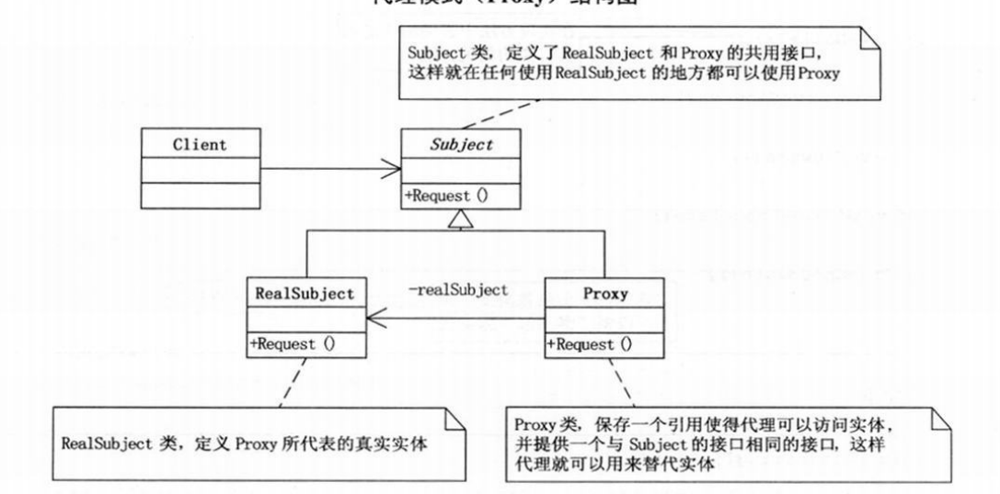

# 代理模式



```c++
#include <iostream>
#include <memory>
#include <iostream>
#include <string>

class Object 
{
public:
	virtual void doSomething() = 0;
	virtual ~Object() {}
};

class Pursuit : public Object
{
private:
	std::string pursiter;
public:
	Pursite(const std::string& name)
	{
		pursiter = name;
	}

	virtual void doSomething() override
	{
		std::cout << "我是" << pursiter << "追求者" << std::endl;
	}
	virtual ~Pursite() {}
};

class Proxy : public Object
{
public:
	Proxy(std::string name): Pursiter(std::make_shared<Pursuit>(name)){};
	~Proxy() {};
	virtual void doSomething() override {
		if (Pursiter)
		{
			std::cout << "我要追求 xxx 了" << std::endl;
			Pursiter->doSomething();
		}
	}
private:
	std::shared_ptr<Pursuit> Pursiter;
};

int main()
{
	Proxy proxy("123");
	proxy.doSomething();
}
```


远程代理： 也就是为一个对象在不同地址空间提供局部代表。这样可以隐藏一个对象存在于不同地址空间的事实[DP]。

虚拟代理：是根据需要创建开销很大的对象。通过它存放在实例化需要很长时间的真实对象。

安全代理：用来控制真实对象访问时的权限【DP】。代理处理另外一些事。


