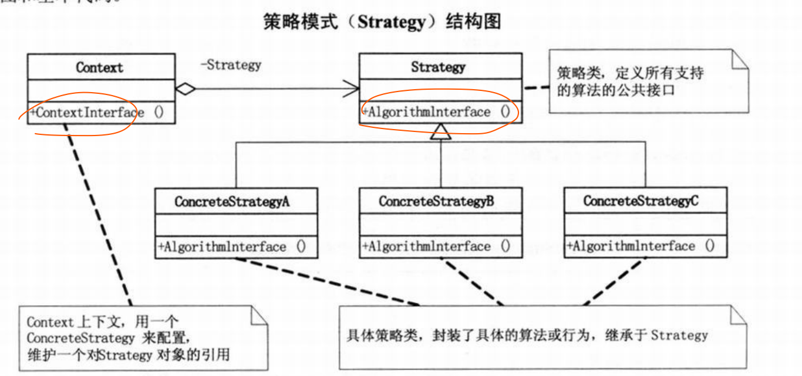

# 策略模式



策略模式核心的思想是对现实生活中具有相同目的，但实现方式不同的一种抽象。以相同的方法调用，减少了各个算法的耦合。

**商品的售价可能会随着不同的事件做出不同的决策**

相对于面向对象的写法，闭包的写法，我感觉也很有意思：

类似这样，要不然 总定义一个类太中二了。

```c++
typedef int (* accept_cash)();
int CashRebate(int cash)
{}
int CashRebate(int cash, float ratio)
{}
std::function<accept_cash> ope = std::function<accept_cash>(accept_cash, std::bind(_1, 1), std::bind(_2, 2));;
class CashContent 
{
    int get_result() const
    {
        return ope();
    }
private:
    std::function<accept_cash> ope;
}
```
