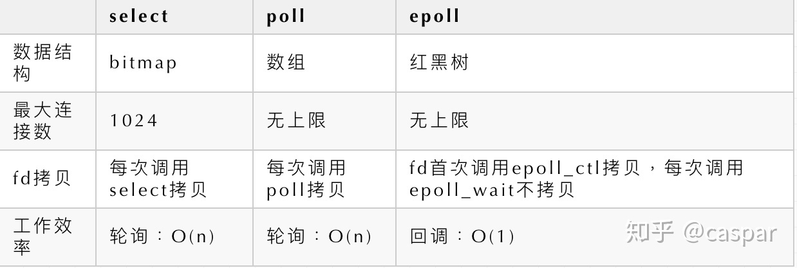

## **目录**

1、什么是IO多路复用?
2、为什么出现IO多路复用机制?
3、IO多路复用的三种实现方式
4、select函数接口
5、select使用示例
6、select缺点
7、poll函数接口
8、poll使用示例
9、poll缺点
10、epoll函数接口
11、epoll使用示例
12、epoll缺点
13、epoll LT 与 ET模式的区别
14、epoll应用
15、select/poll/epoll之间的区别
16、IO多路复用完整代码实现
17、高频面试题 

## **1、什么是IO多路复用**

**「定义」**

- IO多路复用是一种同步IO模型，实现一个线程可以监视多个文件句柄；一旦某个文件句柄就绪，就能够通知应用程序进行相应的读写操作；没有文件句柄就绪时会阻塞应用程序，交出cpu。多路是指网络连接，复用指的是同一个线程

## **2、为什么有IO多路复用机制?**

>  没有IO多路复用机制时，有BIO、NIO两种实现方式，但有一些问题
>  

### **同步阻塞（BIO）**

- 服务端采用单线程，当accept一个请求后，在recv或send调用阻塞时，将无法accept其他请求（必须等上一个请求处recv或send完），`无法处理并发`

```text
// 伪代码描述
while(1) {
  // accept阻塞
  client_fd = accept(listen_fd)
  fds.append(client_fd)
  for (fd in fds) {
    // recv阻塞（会影响上面的accept）
    if (recv(fd)) {
      // logic
    }
  }  
}
```

- 服务器端采用多线程，当accept一个请求后，开启线程进行recv，可以完成并发处理，但随着请求数增加需要增加系统线程，`大量的线程占用很大的内存空间，并且线程切换会带来很大的开销，10000个线程真正发生读写事件的线程数不会超过20%，每次accept都开一个线程也是一种资源浪费`

```text
// 伪代码描述
while(1) {
  // accept阻塞
  client_fd = accept(listen_fd)
  // 开启线程read数据（fd增多导致线程数增多）
  new Thread func() {
    // recv阻塞（多线程不影响上面的accept）
    if (recv(fd)) {
      // logic
    }
  }  
}
```

### **同步非阻塞（NIO）**

- 服务器端当accept一个请求后，加入fds集合，每次轮询一遍fds集合recv(非阻塞)数据，没有数据则立即返回错误，`每次轮询所有fd（包括没有发生读写事件的fd）会很浪费cpu`

```c++
setNonblocking(listen_fd)
// 伪代码描述
while(1) {
  // accept非阻塞（cpu一直忙轮询）
  client_fd = accept(listen_fd)
  if (client_fd != null) {
    // 有人连接
    fds.append(client_fd)
  } else {
    // 无人连接
  }  
  for (fd in fds) {
    // recv非阻塞
    setNonblocking(client_fd)
    // recv 为非阻塞命令
    if (len = recv(fd) && len > 0) {
      // 有读写数据
      // logic
    } else {
       无读写数据
    }
  }  
}
```

### **IO多路复用（现在的做法）**

- 服务器端采用单线程通过select/epoll等系统调用获取fd列表，遍历有事件的fd进行accept/recv/send，使其能`支持更多的并发连接请求`

```c++
fds = [listen_fd]
// 伪代码描述
while(1) {
  // 通过内核获取有读写事件发生的fd，只要有一个则返回，无则阻塞
  // 整个过程只在调用select、poll、epoll这些调用的时候才会阻塞，accept/recv是不会阻塞
  for (fd in select(fds)) {
    if (fd == listen_fd) {
        client_fd = accept(listen_fd)
        fds.append(client_fd)
    } else if (len = recv(fd) && len != -1) { 
      // logic
    }
  }  
}
```

## **3、IO多路复用的三种实现方式**

- select
- poll
- epoll

## **4、select函数接口**

```c++
#include <sys/select.h>
#include <sys/time.h>

#define FD_SETSIZE 1024
#define NFDBITS (8 * sizeof(unsigned long))
#define __FDSET_LONGS (FD_SETSIZE/NFDBITS)

// 数据结构 (bitmap)
typedef struct {
    unsigned long fds_bits[__FDSET_LONGS];
} fd_set;

// API
int select(
    int max_fd, 
    fd_set *readset, 
    fd_set *writeset, 
    fd_set *exceptset, 
    struct timeval *timeout
)                              // 返回值就绪描述符的数目

FD_ZERO(int fd, fd_set* fds)   // 清空集合
FD_SET(int fd, fd_set* fds)    // 将给定的描述符加入集合
FD_ISSET(int fd, fd_set* fds)  // 判断指定描述符是否在集合中 
FD_CLR(int fd, fd_set* fds)    // 将给定的描述符从文件中删除  
```

## **5、select使用示例**

```c++
int main() {
  /*
   * 这里进行一些初始化的设置，
   * 包括socket建立，地址的设置等,
   */

  fd_set read_fs, write_fs;
  struct timeval timeout;
  int max = 0;  // 用于记录最大的fd，在轮询中时刻更新即可

  // 初始化比特位
  FD_ZERO(&read_fs);
  FD_ZERO(&write_fs);

  int nfds = 0; // 记录就绪的事件，可以减少遍历的次数
  while (1) {
    // 阻塞获取
    // 每次需要把fd从用户态拷贝到内核态
    nfds = select(max + 1, &read_fd, &write_fd, NULL, &timeout);
    // 每次需要遍历所有fd，判断有无读写事件发生
    for (int i = 0; i <= max && nfds; ++i) {
      if (i == listenfd) {
         --nfds;
         // 这里处理accept事件
         FD_SET(i, &read_fd);//将客户端socket加入到集合中
      }
      if (FD_ISSET(i, &read_fd)) {
        --nfds;
        // 这里处理read事件
      }
      if (FD_ISSET(i, &write_fd)) {
         --nfds;
        // 这里处理write事件
      }
    }
  }
```

## **6、select缺点**

- 单个进程所打开的FD是有限制的，通过FD_SETSIZE设置，默认1024
- 每次调用select，都需要把fd集合从用户态拷贝到内核态，这个开销在fd很多时会很大
- 对socket扫描时是线性扫描，采用轮询的方法，效率较低（高并发时）

## **7、poll函数接口**

> poll与select相比，只是没有fd的限制，其它基本一样

```c++
#include <poll.h>
// 数据结构
struct pollfd {
    int fd;                         // 需要监视的文件描述符
    short events;                   // 需要内核监视的事件
    short revents;                  // 实际发生的事件
};

// API
int poll(struct pollfd fds[], nfds_t nfds, int timeout);
```

## **8、poll使用示例**

```c++
// 先宏定义长度
#define MAX_POLLFD_LEN 4096  

int main() {
  /*
   * 在这里进行一些初始化的操作，
   * 比如初始化数据和socket等。
   */

// # define POLLRDNORM 0x040 /* Normal data may be read. */
// # define POLLRDBAND 0x080 /* Priority data may be read. */
// # define POLLWRNORM 0x100 /* Writing now will not block. */
// # define POLLWRBAND 0x200 /* Priority data may be written. */
  int nfds = 0;
  pollfd fds[MAX_POLLFD_LEN];
  memset(fds, 0, sizeof(fds));
  fds[0].fd = listenfd;
  fds[0].events = POLLRDNORM;
  int max  = 0;  // 队列的实际长度，是一个随时更新的，也可以自定义其他的
  int timeout = 0;

  int current_size = max;
  while (1) {
    // 阻塞获取
    // 每次需要把fd从用户态拷贝到内核态
    nfds = poll(fds, max+1, timeout);
    if (fds[0].revents & POLLRDNORM) {
        // 这里处理accept事件
        connfd = accept(listenfd);
        //将新的描述符添加到读描述符集合中
    }
    // 每次需要遍历所有fd，判断有无读写事件发生
    for (int i = 1; i < max; ++i) {     
      if (fds[i].revents & POLLRDNORM) { 
         sockfd = fds[i].fd
         if ((n = read(sockfd, buf, MAXLINE)) <= 0) {
            // 这里处理read事件
            if (n == 0) {
                close(sockfd);
                fds[i].fd = -1;
            }
         } else {
             // 这里处理write事件     
         }
         if (--nfds <= 0) {
            break;       
         }   
      }
    }
  }
```

## **9、poll缺点**

- 每次调用poll，都需要把fd集合从用户态拷贝到内核态，这个开销在fd很多时会很大
- 对socket扫描时是线性扫描，采用轮询的方法，效率较低（高并发时）

## **10、epoll函数接口**

```c++
#include <sys/epoll.h>

// 数据结构
// 每一个epoll对象都有一个独立的eventpoll结构体
// 用于存放通过epoll_ctl方法向epoll对象中添加进来的事件
// epoll_wait检查是否有事件发生时，只需要检查eventpoll对象中的rdlist双链表中是否有epitem元素即可
struct eventpoll {
    /*红黑树的根节点，这颗树中存储着所有添加到epoll中的需要监控的事件*/
    struct rb_root  rbr;
    /*双链表中则存放着将要通过epoll_wait返回给用户的满足条件的事件*/
    struct list_head rdlist;
};

// API

int epoll_create(int size); // 内核中间加一个 ep 对象，把所有需要监听的 socket 都放到 ep 对象中
int epoll_ctl(int epfd, int op, int fd, struct epoll_event *event); // epoll_ctl 负责把 socket 增加、删除到内核红黑树
int epoll_wait(int epfd, struct epoll_event * events, int maxevents, int timeout);// epoll_wait 负责检测可读队列，没有可读 socket 则阻塞进程
```

## **11、epoll使用示例**

```c++
int main(int argc, char* argv[])
{
   /*
   * 在这里进行一些初始化的操作，
   * 比如初始化数据和socket等。
   */

    // 内核中创建ep对象
    epfd=epoll_create(256);
    // 需要监听的socket放到ep中
    epoll_ctl(epfd,EPOLL_CTL_ADD,listenfd,&ev);
 
    while(1) {
      // 阻塞获取
      nfds = epoll_wait(epfd,events,20,0);
      for(i=0;i<nfds;++i) {
          if(events[i].data.fd==listenfd) {
              // 这里处理accept事件
              connfd = accept(listenfd);
              // 接收新连接写到内核对象中
              epoll_ctl(epfd,EPOLL_CTL_ADD,connfd,&ev);
          } else if (events[i].events&EPOLLIN) {
              // 这里处理read事件
              read(sockfd, BUF, MAXLINE);
              //读完后准备写
              epoll_ctl(epfd,EPOLL_CTL_MOD,sockfd,&ev);
          } else if(events[i].events&EPOLLOUT) {
              // 这里处理write事件
              write(sockfd, BUF, n);
              //写完后准备读
              epoll_ctl(epfd,EPOLL_CTL_MOD,sockfd,&ev);
          }
      }
    }
    return 0;
}
```

## **12、epoll缺点**

- epoll只能工作在linux下

## **13、epoll LT 与 ET模式的区别**

- epoll有EPOLLLT和EPOLLET两种触发模式，LT是默认的模式，ET是“高速”模式。
- LT模式下，**只要这个fd还有数据可读，每次 epoll_wait都会返回它的事件，提醒用户程序去操作**
- ET模式下，**它只会提示一次，直到下次再有数据流入之前都不会再提示了，无论fd中是否还有数据可读。所以在ET模式下，read一个fd的时候一定要把它的buffer读完，或者遇到EAGAIN错误**

## **14、epoll应用**

- redis
- nginx

## **15、select/poll/epoll之间的区别**



## **16、完整代码示例**

**代码示例**[1]

## **17、高频面试题**

- 什么是IO多路复用?

- nginx/redis 所使用的IO模型是什么？

- select、poll、epoll之间的区别

- epoll 水平触发（LT）与 边缘触发（ET）的区别？

  

https://link.zhihu.com/?target=https%3A//github.com/caijinlin/learning-pratice/tree/master/linux/io

### 